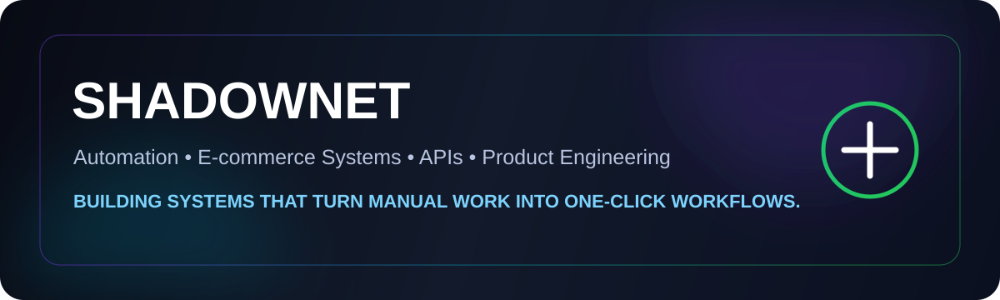

<p align="center">
  
</p>

<h1 align="center">Hey, I'm SHADOWNET 👋</h1>
<p align="center">
  I build practical automation systems, e-commerce tools, APIs, and workflows that remove repetitive work.
</p>

<p align="center">
  
  
  
</p>

---

## ⚡ What I Build

I like turning messy, manual processes into clean systems that are fast, repeatable, and easy to use.

- 🛒 E-commerce automation and marketplace workflows
- 🤖 Product importers and smart data processing
- 🔌 API integrations and backend services
- ☁️ Cloud deployments and production tooling
- 🧠 AI-assisted workflow automation

> **Build once. Automate the repetitive part. Keep improving the system.**

---

## 🚀 Featured Project

### Jumia WhatsApp Importer
A production workflow built to transform WhatsApp product exports into Jumia-ready product data with far less manual work.

**Pipeline:** `WhatsApp Export → Product Parsing → Image Handling → Category Matching → Pricing → Validation → Jumia-ready Output`

<p>
  <a href="https://github.com/sammymuya167-hash/jumia-whatsapp-importer">
    
  </a>
</p>

---

## 🧰 Tech Dashboard

<p align="center">
  
</p>

<p align="center">
  
  
  
  
</p>

---

## 📊 GitHub Dashboard

<p align="center">
  
  
</p>

<p align="center">
  
</p>

---

## 🎯 Current Mission

**Make powerful tools feel simple.**

I’m focused on building systems where complicated work happens behind the scenes and the user gets a clean, reliable experience on the front end.

```text
Idea → Build → Test → Automate → Deploy → Improve
```

---

<p align="center">
  <b>⚙️ Automation first • 🚀 Built to ship • 🔁 Always improving</b>
</p>

<p align="center">
  
</p>
