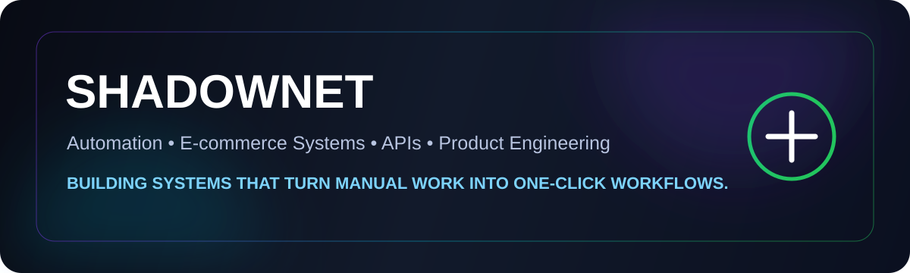

  

# SHADOWNET

I build practical software for commerce, operations, and automation — from marketplace integrations to full-stack tools.

My work focuses on useful workflows, clear interfaces, tested server behavior, and deployments that can be reviewed.

## Featured projects

| Project | What it demonstrates | Explore |
|---|---|---|
| **RouteForge** | Delivery office, signed Android Rider, five-second offers, offline GPS/reports, trip completion, sales/till totals and reviewed mileage | [Source & setup](projects/routeforge) · [Live demo](https://routeforge-shadownet.sammymuya167.chatgpt.site) |
| **SprintForge** | Sprint planning with Kanban, dependency graphs, burndown, comments, private D1 autosave and revision conflict protection | [Source & setup](projects/sprintforge) · [Live demo](https://sprintforge-shadownet.sammymuya167.chatgpt.site) |
| **RequestLab** | Real HTTP requests, collections, environments, declarative assertions, a live mock API and private saved run summaries | [Source & setup](projects/requestlab) · [Live demo](https://requestlab-shadownet.sammymuya167.chatgpt.site) |
| **CanvasRoom** | Original SVG design canvas with draggable shapes, connectors, review comments, private saves and restorable snapshots | [Source & setup](projects/canvasroom) · [Live demo](https://canvasroom-shadownet.sammymuya167.chatgpt.site) |
| **IT operations & security portfolio** | Support tracking, authentication log triage, and an offline network configuration auditor; synthetic case studies and 19 automated tests | [Source & case studies](portfolio/README.md) |
| **Jumia WhatsApp Importer** | Product export parsing, image processing, category matching, pricing, validation, and marketplace integration | [Private repository](https://github.com/sammymuya167-hash/jumia-whatsapp-importer) |

## Latest builds

Four projects from the supplied *Full Stack Projects* catalogue are now built, publicly deployed, and documented.

- **RouteForge (#92):** manage company orders with a signed Rider app, five-second offers, completion/payment reports, verified sales totals and live GPS.
- **SprintForge (#33):** plan sprints, enforce dependencies, track progress and retain project activity.
- **RequestLab (#98):** inspect real HTTP responses and run repeatable API contract tests.
- **CanvasRoom (#77):** map product flows, connect ideas, review comments and restore private snapshots.

CanvasRoom adds 5 focused canvas-domain tests plus clean lint, typecheck, migration and production Worker builds. The existing SprintForge and RequestLab suites retain 27 domain/request tests and 33 built-Worker/D1 integration checks.

Portfolio source and demo access are public. Saved workspaces remain private to each signed-in account. Distances and arrival times are estimates; it does not claim live traffic or turn-by-turn navigation.

[Read the architecture](projects/routeforge/docs/ARCHITECTURE.md) · [Build roadmap](projects/routeforge/docs/ROADMAP.md) · [100 project ideas](projects/routeforge/docs/catalog.json)

## Tools I work with

**Languages:** TypeScript, JavaScript, Python  
**Applications:** React, Vinext / Next.js, APIs, automation workers  
**Data & hosting:** Cloudflare Workers and D1, Railway, Supabase, Vercel  
**Workflow:** Git, GitHub, meaningful tests, documented deployment and attribution

## Build practice

I am developing one substantial portfolio project at a time, aiming for a daily release. Every build should include usable behavior, a clear setup guide, honest limitations, source attribution, and meaningful verification. Reference projects are credited; AI-assisted implementation is identified.

**Current direction:** make complicated operational work easier to manage.
