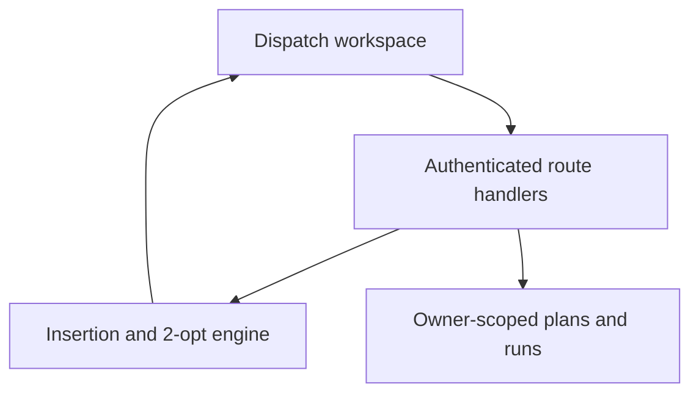

# RouteForge

**Your office, in motion.** A delivery office with real company drivers, registered destinations and live GPS, by SHADOWNET.

[Open the deployed app](https://routeforge-shadownet.sammymuya167.chatgpt.site) · [Office guide](docs/OFFICE.md) · [Architecture](docs/ARCHITECTURE.md) · [Build roadmap](docs/ROADMAP.md) · [MIT licence](LICENSE)

The public shell is accessible to visitors. Company orders, partner destinations, driver details, office settings, saved plans and GPS journeys remain private to the signed-in account. The source is public. Project 92 from the supplied *Full Stack Projects* PDF inspired the product direction.

## What works

- The main office uses actual paired company phones and an OpenStreetMap basemap. Live counters and fleet records contain no seeded vehicles or orders.
- Persistent collection/delivery requests, a waiting queue and a retained completed/cancelled order history.
- Saved partner shops, searched location suggestions, latitude/longitude selection and a draggable map crosshair for checking the entrance.
- Automatic assignment to a free, on-duty driver with fresh GPS, prioritizing longest idle time then pickup proximity. Manual assignment uses the same onboarded directory and server checks.
- A single active assignment per phone, protected against simultaneous dispatchers and order double-booking.
- Two-stage collection and drop-off: conservative GPS arrival, office confirmation, and progress shared with the tracking portal.
- Driver details, vehicle/contact updates, click-to-call links and optional per-kilometre rates.
- A functional Live tracking dialog with a driver column, live map, movement/battery telemetry and selected driver's recent GPS journey.
- Recorded GPS mileage and suggested pay estimates, excluding gaps and uncertain segments; office CSV export.
- Consensual Android GPS tracking with an offline queue and unchanged upload contract. Existing phones keep their current APK and pairing.
- Pointer-anchored map zoom, drag/pinch, keyboard controls, driver follow, fullscreen, creative movement icons and zoom level 19.
- Previous saved planning scenarios, runs and manifests remain in the Saved plans archive. The constrained optimizer remains in the source and authenticated API.

## Use the office

1. Sign in at the [main office](https://routeforge-shadownet.sammymuya167.chatgpt.site). Existing paired phones appear automatically.
2. Open **Main office** settings and check the actual office entrance pin. Open **Driver details** to complete vehicle, phone, duty and optional rate fields.
3. Register your shops in **Partner destinations**. Search an address and check the pin on the map; saved partners are suggested immediately.
4. Choose **New delivery**, select collection and destination locations, and choose automatic or manual assignment. Save to queue when no driver is available.
5. Follow the driver in **Live tracking**. Confirm collection after GPS pickup arrival; confirm delivery after destination arrival.
6. Review recorded mileage before paying. Export orders from **Deliveries**; payments are handled outside this app.

Driver-side destination navigation is reserved for the later Android update. This release manages assignments in the office while the existing phone recorder continues unchanged.

## Stack

TypeScript · React 19 · Vinext · Cloudflare Workers · D1 · Drizzle · Zod · Lucide · Sites-managed ChatGPT authentication.



## Run locally

Node >=22.13 and pnpm 11.25 are required. Start in this project directory:

```sh
pnpm install --frozen-lockfile
pnpm test
pnpm run typecheck
pnpm run lint
pnpm run build
```

Apply all migrations in order to local D1 before using saved plans or tracking:

```sh
for migration in drizzle/*.sql; do
  node --import ./scripts/sites-env.mjs ./node_modules/wrangler/bin/wrangler.js d1 execute DB --local --config dist/server/wrangler.json --persist-to .wrangler/state --file "$migration"
done
pnpm run dev
```

Clean clones default to portable development on http://localhost:5173. The supplied portable starter simulates a local identity through `/signin-with-chatgpt?return_to=/`; hosted identity is owned by Sites. Do not trust manually supplied identity headers on an unrestricted production server: the production Worker must stay behind the Sites access layer or an equivalent authenticated gateway.

The checked-in `.openai/hosting.json` belongs to the original deployment. Provision your own project and D1 binding when deploying a copy. Generated build output, local databases, credentials and tool state are ignored.

## Model and limitations

Distances are haversine × a configurable detour factor. Travel time uses a constant average speed. Cost is estimated from the vehicle's per-km rate; it excludes fixed charges, parking, taxes and driver labour. Delivery windows constrain arrival / service start. Vehicles start and finish at the same depot.

The retained optimizer distance comparison keeps the same assigned stops and vehicle allocation, sorted into original input order. It is a distance baseline, not a validated dispatch schedule. The optimizer is a deterministic heuristic and does not guarantee a global optimum. Place suggestions use the public Photon geocoder restricted to Kenya, with owner-scoped caching and a global request reservation. It has no SLA; saved partners, manual coordinates and map pin selection remain available if search is down. Search coordinates can represent an area centre rather than an entrance, so check the pin. There is no road graph, live traffic or turn-by-turn navigation. Tracking lines connect recorded GPS fixes and break across long gaps or trips.

Movement labels are GPS speed estimates, not Android activity recognition or proof that a person is in a car. Arrival uses two accurate fixes within the destination radius, at least 15 seconds apart in one trip. It does not prove parcel delivery. Street View opens available historical imagery, not a live camera. One current dispatch is retained per device. New office orders retain their outcomes and distance/rate snapshots; legacy standalone dispatches do not have a separate audit archive. Longest-free assignment uses office assignment/release timestamps, not Android activity recognition. GPS distance is not certified billing distance.

## Validation

The Node test suite covers driver eligibility and fairness, mileage uncertainty, coordinate parsing, telephone links, collection/drop-off states, map geometry, complete optimizer assignment, overloaded stops, impossible windows, shift returns, early-arrival waiting, inactive vehicles, deterministic results, varied constraints, geodesic edge cases, CSV quoting, duplicate IDs, limits and spreadsheet formula protection. The sample assigns all 16 deliveries without a hard-constraint violation.

Run `pnpm test`, `pnpm run typecheck`, and `pnpm run lint`. Unit checks also cover zoom anchoring, pan geometry, arrival uncertainty, duplicate/offline fixes and movement freshness. After a build, `pnpm run test:integration` executes the actual production Worker against disposable D1: account isolation, optimizer persistence, pairing, immutable uploads, dispatch assignment, arrival, confirmation, cancellation, stale actions, office/partner ownership, idempotent orders, simultaneous reservations, both delivery stages, mileage/rate snapshots, geocoder failure/cache/rate-limit contracts and the unchanged APK checksum. Geocoder contract fixtures are mocked; public-provider availability and actual phone/browser interaction are not claimed as test results. The root portfolio repository contains a path-scoped GitHub Actions workflow for this project. A production build is packaged and deployed from the exact pushed source commit. Automated browser QA was unavailable in the build environment; no browser test result is claimed.

## Origin and attribution

Reference: [VROOM-Project/vroom](https://github.com/VROOM-Project/vroom), copyright Julien Coupey, BSD-2-Clause. Its licence is retained in [docs/VROOM-LICENSE.txt](docs/VROOM-LICENSE.txt). RouteForge's TypeScript algorithm and interface are original AI-assisted implementation; the VROOM C++ engine is not embedded or called. VROOM's upstream contributors are not credited as authors of RouteForge, and this project does not claim VROOM's benchmarks or optimality.

The hosting and authentication scaffold comes from the Sites Vinext starter. Third-party dependencies and retained scaffold files keep their respective licences. Original RouteForge code is MIT licensed. Photon is an external geocoder, Apache-2.0 licensed; no Photon code was copied. Map and place data come from OpenStreetMap contributors under ODbL. See the [office attribution and service notes](docs/OFFICE.md).

## Driver tracking pilot

[Open the tracking portal](https://routeforge-shadownet.sammymuya167.chatgpt.site/tracking) to pair a consenting Android driver, follow live GPS, inspect journeys and unlink devices. An offline SQLite queue on the phone uploads acknowledged, idempotent events after reconnection. The APK, native source and [operating guide](docs/TRACKING.md) are included. The owner reports a successful real journey test; broad device/OS coverage and offline recovery still require field verification. This dashboard release preserves the installed APK and upload contract. Refresh the web dashboard to receive interface changes; drivers do not need to reinstall or pair again.
