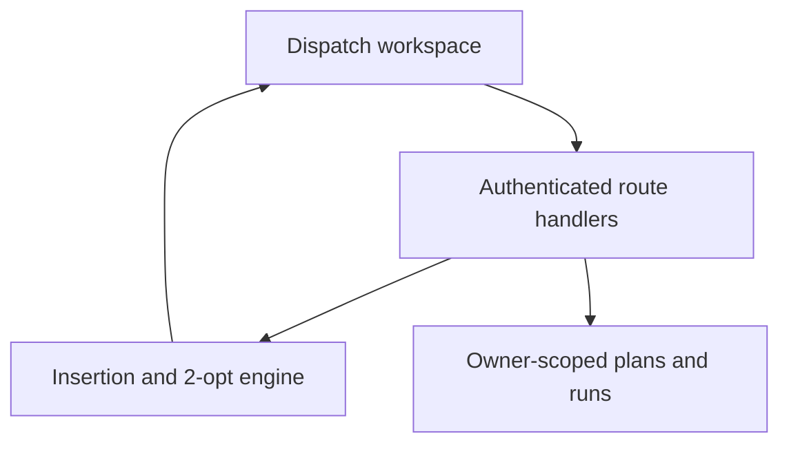

# RouteForge

**Make every mile count.** A full-stack delivery planning workspace by SHADOWNET.

[Open the deployed app](https://routeforge-shadownet.sammymuya167.chatgpt.site) · [Architecture](docs/ARCHITECTURE.md) · [Build roadmap](docs/ROADMAP.md) · [MIT licence](LICENSE)

The live demo and source are public. ChatGPT sign-in is required to optimize and save; saved plans and run history remain private to each account. Project 92 from the supplied *Full Stack Projects* PDF inspired the product direction.

## What works

- A responsive dispatch workspace with a schematic map, route filtering, zoom and keyboard-accessible delivery pins.
- Editable deliveries with payload, priority, service time and arrival windows; validated CSV import supports up to 60 stops.
- Up to eight vehicles with availability, capacity, shift hours and per-kilometre rates.
- Server-side feasible cheapest insertion and bounded 2-opt. Every accepted route respects capacity, arrival windows and return-to-depot shift deadlines.
- Ordered driver manifests with arrival, departure and waiting times; route and fleet-level CSV exports.
- Durable private saved scenarios, immutable optimization snapshots and reversible archiving in Cloudflare D1.
- An explicit unassigned queue with reasons when the model cannot fit a stop.

## Try it

1. Open the public preview, sign in for optimization/saving, and use **Load sample** for 16 synthetic Nairobi deliveries.
2. Choose **Optimize routes**, then inspect a route card for its driver manifest.
3. Change a delivery window or vehicle capacity, optimize again and inspect unassigned stops.
4. Use **Save plan** and revisit it from **Saved plans**. Export CSV for the ordered stop list.

## Stack

TypeScript · React 19 · Vinext · Cloudflare Workers · D1 · Drizzle · Zod · Lucide · Sites-managed ChatGPT authentication.



## Run locally

Node >=22.13 and pnpm 11.25 are required. Start in this project directory:

```sh
pnpm install --frozen-lockfile
pnpm test
pnpm run typecheck
pnpm run lint
pnpm run build
```

Apply the initial migration to local D1 before using saved plans:

```sh
node --import ./scripts/sites-env.mjs ./node_modules/wrangler/bin/wrangler.js d1 execute DB --local --config dist/server/wrangler.json --persist-to .wrangler/state --file drizzle/0000_open_king_bedlam.sql
pnpm run dev
```

Clean clones default to portable development on http://localhost:5173. The supplied portable starter simulates a local identity through `/signin-with-chatgpt?return_to=/`; hosted identity is owned by Sites. Do not trust manually supplied identity headers on an unrestricted production server: the production Worker must stay behind the Sites access layer or an equivalent authenticated gateway.

The checked-in `.openai/hosting.json` belongs to the original deployment. Provision your own project and D1 binding when deploying a copy. Generated build output, local databases, credentials and tool state are ignored.

## Model and limitations

Distances are haversine × a configurable detour factor. Travel time uses a constant average speed. Cost is estimated from the vehicle's per-km rate; it excludes fixed charges, parking, taxes and driver labour. Delivery windows constrain arrival / service start. Vehicles start and finish at the same depot.

The distance comparison keeps the same assigned stops and vehicle allocation, sorted into original input order. It is a distance baseline, not a validated dispatch schedule. The optimizer is a deterministic heuristic and does not guarantee a global optimum. There is no road graph, live traffic, geocoding, GPS tracking or turn-by-turn navigation. Map lines are schematic connections.

## Validation

The Node test suite covers complete assignment, overloaded stops, impossible windows, shift returns, early-arrival waiting, inactive vehicles, deterministic results, varied constraints, geodesic edge cases, CSV quoting, duplicate IDs, limits and spreadsheet formula protection. The sample assigns all 16 deliveries without a hard-constraint violation.

Run `pnpm test`, `pnpm run typecheck`, and `pnpm run lint`. After a build, `pnpm run test:integration` executes the actual production Worker against disposable D1: rendering, authentication requirements, same-origin writes, save/reload, cross-account denial, archive/restore and persisted optimization history. The root portfolio repository contains a path-scoped GitHub Actions workflow for this project. A production build is packaged and deployed from the exact pushed source commit. Automated browser QA was unavailable in the build environment; no browser test result is claimed.

## Origin and attribution

Reference: [VROOM-Project/vroom](https://github.com/VROOM-Project/vroom), copyright Julien Coupey, BSD-2-Clause. Its licence is retained in [docs/VROOM-LICENSE.txt](docs/VROOM-LICENSE.txt). RouteForge's TypeScript algorithm and interface are original AI-assisted implementation; the VROOM C++ engine is not embedded or called. VROOM's upstream contributors are not credited as authors of RouteForge, and this project does not claim VROOM's benchmarks or optimality.

The hosting and authentication scaffold comes from the Sites Vinext starter. Third-party dependencies and retained scaffold files keep their respective licences. Original RouteForge code is MIT licensed.
